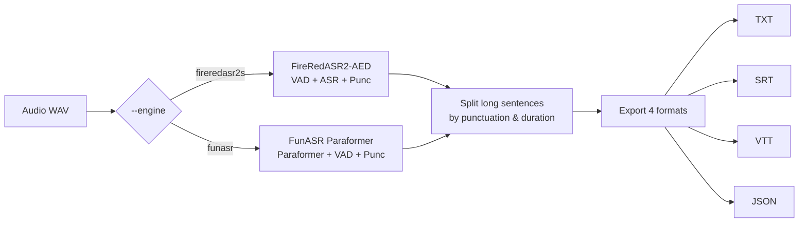
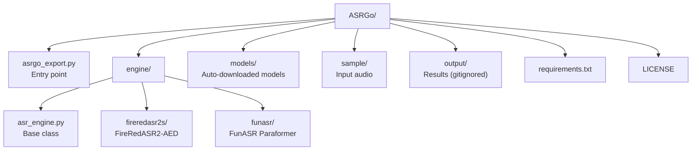

# ASRGo

**Chinese ASR system with dual-engine architecture.** Transcribe audio to TXT, SRT, VTT, and JSON in one command.

[](LICENSE)
[](https://www.python.org/)
[](https://modelscope.cn)

[中文](README_zh.md) · [English](README.md)

---

## Features

- **Dual engine** — FireRedASR2-AED (high accuracy, CER 3.05%) or FunASR Paraformer (lightweight)
- **Plugin architecture** — add new engines by creating a single file, no existing code changes
- **Auto-download** — models download from ModelScope on first run, no manual setup
- **Four export formats** — TXT, SRT, VTT, JSON from a single command
- **Timestamps** — sentence-level timing for subtitle output
- **Simple CLI** — one script, no complex config

---

## Dependencies

### FireRed Engine

The fireredasr2s package (FireRedASR2S inference framework) auto-downloads from GitHub on first use.

Model weights will auto-download from ModelScope on first run.

### FunASR Engine

No additional installation needed; dependencies are in requirements.txt.

---

## Quick Start

```bash
# Install dependencies
pip install -r requirements.txt

# Run with default audio (sample/input.wav)
python asrgo_export.py

# Or specify your own audio
python asrgo_export.py --audio /path/to/audio.wav --engine funasr
```

First run downloads models automatically (~5 GB). A `sample/input.wav` (16 kHz WAV) is required.

---

## Engine Comparison

| | FireRedASR2-AED | FunASR Paraformer |
|---|---|---|
| Error Rate (CER) | 3.05% | ~5% |
| Speed | ~42s per 5min audio | faster |
| VRAM | ~8 GB | ~2 GB |
| Timestamps | sentence + word | sentence only |
| Model size | ~4.4 GB | ~1.2 GB |

Use `--engine fireredasr2s` (default) for accuracy, `--engine funasr` for speed.

---

## CLI Usage

```
python asrgo_export.py [--audio PATH] [--output DIR]
                             [--device DEVICE] [--engine NAME]
```

| Argument | Default | Description |
|---|---|---|
| `--audio, -a` | `sample/input.wav` | Input audio file (16 kHz WAV recommended) |
| `--output, -o` | `output` | Root output directory |
| `--device` | `cuda:0` | `cuda:0` for GPU, `cpu` for CPU |
| `--engine` | `fireredasr2s` | `fireredasr2s` or `funasr` |

Output is written to `output/{engine}/{audio_name}/`:
- `transcript.txt` — plain text
- `transcript.srt` — SubRip subtitles
- `transcript.vtt` — WebVTT subtitles
- `transcript.json` — structured data (text + sentences + timestamps)

---

## How It Works



---

## Project Structure



---

## Requirements

- Python 3.8+
- 8 GB+ RAM
- NVIDIA GPU with 8 GB+ VRAM (recommended; CPU works but is slower)
- 6 GB free disk for model files

---

## License

- Project code: [MIT](LICENSE)
- FireRedASR2 models: Apache 2.0
- FunASR models: MIT

## Acknowledgments

- [FireRedASR2S](https://github.com/FireRedTeam/FireRedASR2S) — open-source ASR by Xiaohongshu
- [FunASR](https://github.com/modelscope/FunASR) — speech toolkit by Alibaba DAMO Academy
- [ModelScope](https://modelscope.cn) — model distribution platform
