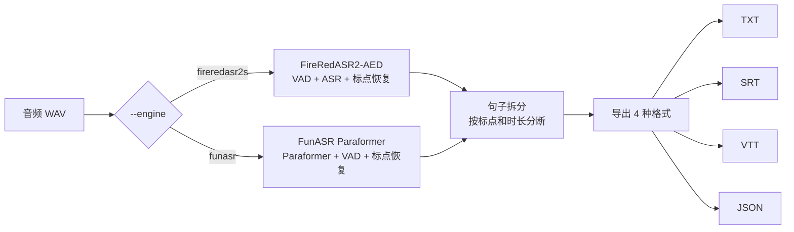
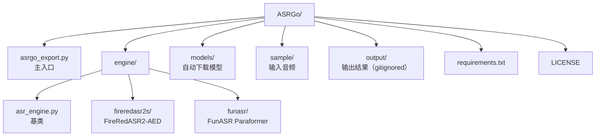

# ASRGo

**双引擎中文语音识别系统。** 一行命令将音频转为 TXT / SRT / VTT / JSON 四种格式。

[](LICENSE)
[](https://www.python.org/)
[](https://modelscope.cn)

[中文](README_zh.md) · [English](README.md)

---

## 功能

- **双引擎可选** — FireRedASR2-AED（高精度，误字率仅 CER 3.05%）或 FunASR Paraformer（轻量快速）
- **插件式引擎架构** — 添加新引擎只需新建一个文件，无需修改已有代码
- **自动下载模型** — 首次运行自动从 ModelScope 下载，无需手动操作
- **四种导出格式** — 一次运行同时输出 TXT、SRT、VTT、JSON
- **时间戳输出** — 句子级时间戳，直接用于字幕
- **上手简单** — 一个脚本，无需复杂配置

---

## 依赖安装

### FireRed 引擎依赖

fireredasr2s Python 包（FireRedASR2S 的推理框架）首次使用时从 GitHub 自动下载。

模型权重会自动从 ModelScope 下载。

### FunASR 引擎依赖

无需额外安装，依赖已在 requirements.txt 中。

---

## 快速开始

```bash
# 安装依赖
pip install -r requirements.txt

# 使用默认音频（sample/input.wav）运行
python asrgo_export.py

# 指定音频文件和使用 FunASR 引擎
python asrgo_export.py --audio /path/to/audio.wav --engine funasr
```

首次运行会自动下载模型（约 5 GB）。需要准备一个 `sample/input.wav`（16 kHz WAV 格式）。

---

## 引擎对比

| | FireRedASR2-AED | FunASR Paraformer |
|---|---|---|
| 误字率 (CER) | 3.05% | ~5% |
| 速度 | 5 分钟音频约 42s | 较快 |
| 显存 | ~8 GB | ~2 GB |
| 时间戳 | 句子级 + 词级 | 句子级 |
| 模型大小 | ~4.4 GB | ~1.2 GB |

追求精度用 `--engine fireredasr2s`（默认），追求速度用 `--engine funasr`。

---

## CLI 参数

```
python asrgo_export.py [--audio 路径] [--output 目录]
                             [--device 设备] [--engine 引擎名]
```

| 参数 | 默认值 | 说明 |
|---|---|---|
| `--audio, -a` | `sample/input.wav` | 输入音频文件（推荐 16 kHz WAV） |
| `--output, -o` | `output` | 输出根目录 |
| `--device` | `cuda:0` | `cuda:0` 用 GPU，`cpu` 用 CPU |
| `--engine` | `fireredasr2s` | `fireredasr2s` 或 `funasr` |

输出到 `output/{引擎}/{音频名}/` 目录下：
- `transcript.txt` — 纯文本
- `transcript.srt` — SRT 字幕格式
- `transcript.vtt` — WebVTT 网页字幕格式
- `transcript.json` — 结构化数据（文字 + 句子 + 时间戳）

---

## 处理流程



---

## 项目结构



---

## 环境要求

- Python 3.8+
- 8 GB 以上内存
- NVIDIA GPU 8 GB 以上显存（推荐；CPU 也可运行但较慢）
- 6 GB 磁盘空间用于模型文件

---

## 许可证

- 项目代码：[MIT](LICENSE)
- FireRedASR2 模型：Apache 2.0
- FunASR 模型：MIT

## 致谢

- [FireRedASR2S](https://github.com/FireRedTeam/FireRedASR2S) — 小红书开源的语音识别系统
- [FunASR](https://github.com/modelscope/FunASR) — 阿里达摩院语音工具包
- [ModelScope](https://modelscope.cn) — 模型分发平台
