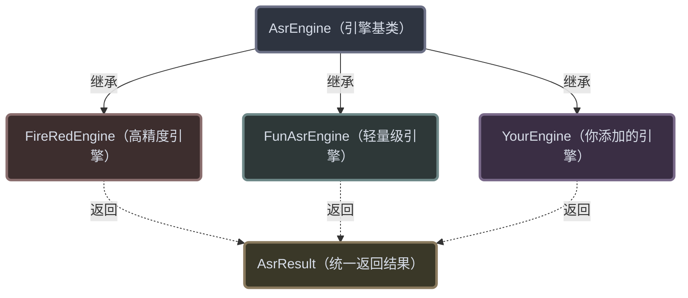
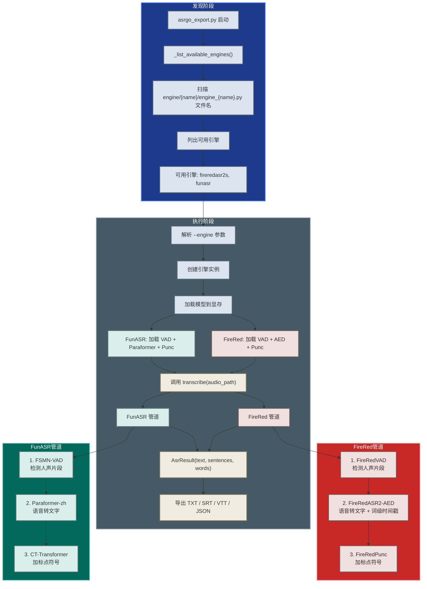

# 引擎架构文档

## 插件式设计

ASRGo 采用插件式引擎架构。添加新引擎不需要修改已有代码，只需按约定创建文件。

核心机制：

1. `engine/asr_engine.py` 定义基类 `AsrEngine`
2. `asrgo_export.py` 扫描 `engine/{引擎名}/engine_{引擎名}.py` 文件名，列出可用引擎
3. 只导入用户选择的引擎文件，不扫描其他引擎代码
4. 每个引擎文件中的 `AsrEngine` 子类被加载使用



### 引擎对比

| 特性 | FireRedASR2 (默认) | FunASR |
|---|---|---|
| 来源 | 小红书开源 | 阿里达摩院开源 |
| 核心模型 | FireRedASR2-AED | Paraformer-zh |
| 误字率 | **CER 3.05%** (业界领先) | CER ~5% |
| 显存需求 | ~8 GB | **~2 GB** (轻量) |
| 时间戳粒度 | **句子级 + 词级** | 句子级 |
| VAD 模型 | FireRedVAD | FSMN-VAD |
| 标点模型 | FireRedPunc | CT-Transformer |
| 管道流程 | VAD → AED → Punc | VAD → Paraformer → Punc |
| 适用场景 | 追求最高精度 | 显存受限/快速部署 |

### 为什么有两个引擎？

**FireRedASR2** — 高精度首选
- CER 3.05%，是目前国产开源 ASR 的天花板
- 词级时间戳，字幕对齐更精确
- 适合：有声书转写、专业字幕制作、精度要求高的场景

**FunASR** — 轻量级之选
- 仅需 2GB 显存，没有 GPU 也能用 CPU 跑
- 阿里巴巴出品，社区活跃、文档完善
- 适合：嵌入式部署、低配机器、快速验证

### 统一返回格式

所有引擎返回 `AsrResult` 对象，包含三个字段：

| 字段 | 类型 | 说明 |
|---|---|---|
| `text` | str | 完整识别文本 |
| `sentences` | list[dict] | 句子列表，每句含 `start_ms`、`end_ms`、`text` |
| `words` | list[dict] | 词列表，每词含 `start_ms`、`end_ms`、`text` |

## 添加新引擎（以 Whisper 为例）

### 第 1 步：创建目录和文件

```
engine/
└── whisper/
    └── engine_whisper.py
```

### 第 2 步：编写引擎类

```python
# engine/whisper/engine_whisper.py
import whisper
from engine.asr_engine import AsrEngine, AsrResult


class WhisperEngine(AsrEngine):
    engine_id = "whisper"  # 对应 --engine whisper

    def __init__(self, device="cuda:0"):
        # 在引擎初始化时加载模型
        self.model = whisper.load_model("large-v3", device=device)

    def transcribe(self, audio_path):
        # 调用 Whisper 做识别
        result = self.model.transcribe(audio_path, language="zh")

        # 组装成 AsrResult 格式
        sentences = []
        words = []
        for seg in result["segments"]:
            sentences.append({
                "start_ms": int(seg["start"] * 1000),
                "end_ms": int(seg["end"] * 1000),
                "text": seg["text"].strip(),
            })

        return AsrResult(
            text=result["text"].strip(),
            sentences=sentences,
            words=words,
        )
```

### 第 3 步：使用

```bash
python asrgo_export.py --engine whisper --audio sample/input.wav
```

`_list_available_engines()` 会自动发现 `WhisperEngine`，无需修改任何已有文件。

## 引擎自动发现流程



## 内置引擎

### FireRedASR2-AED（高精度引擎）

位于 `engine/fireredasr2s/engine_fireredasr2s.py`。

| 属性 | 值 |
|---|---|
| 引擎 ID | `fireredasr2s` |
| 来源 | 小红书开源 |
| 核心模型 | FireRedASR2-AED (端到端) |
| 辅助模型 | FireRedVAD + FireRedPunc |
| 误字率 | **CER 3.05%** |
| 显存 | ~8 GB |
| 时间戳 | 句子级 + **词级** |

**管道流程：**
```
音频 → FireRedVAD(切分人声) → FireRedASR2-AED(转文字+时间戳) → FireRedPunc(加标点) → AsrResult
```

### FunASR Paraformer（轻量级引擎）

位于 `engine/funasr/engine_funasr.py`。

| 属性 | 值 |
|---|---|
| 引擎 ID | `funasr` |
| 来源 | 阿里达摩院开源 |
| 核心模型 | Paraformer-zh |
| 辅助模型 | FSMN-VAD + CT-Transformer |
| 误字率 | ~5% CER |
| 显存 | **~2 GB** |
| 时间戳 | 句子级 |

**管道流程：**
```
音频 → FSMN-VAD(切分人声) → Paraformer-zh(转文字) → CT-Transformer(加标点) → AsrResult
```

### 如何选择？

| 场景 | 推荐引擎 | 理由 |
|---|---|---|
| 有声书转写 | FireRedASR2 | 词级时间戳，对齐精确 |
| 专业字幕制作 | FireRedASR2 | CER 3.05%，业界领先 |
| 低配机器 | FunASR | 仅需 2GB 显存 |
| 嵌入式部署 | FunASR | 轻量级，CPU 也能跑 |
| 快速验证 | FunASR | 启动快，社区活跃 |

## 规范约定

| 项目 | 要求 |
|---|---|
| 文件路径 | `engine/{引擎名}/engine_{引擎名}.py` |
| 类名 | 任意，但需继承 `AsrEngine` |
| 目录名 | 目录名即为 `--engine` 参数值，如 `fireredasr2s`、`funasr` |
| engine_id | 可选类属性，用于旧版兼容 |
| \_\_init\_\_ | 接收 `device="cuda:0"` 参数，加载模型 |
| transcribe() | 接收 `audio_path`，返回 `AsrResult` |
