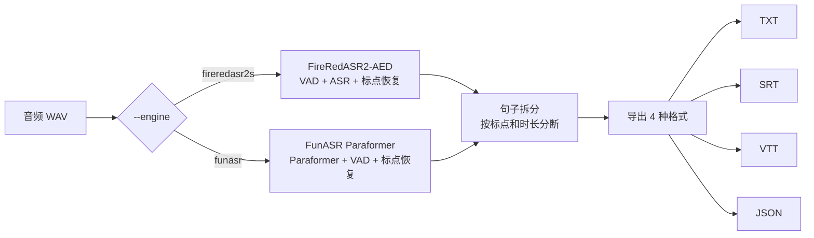

# ASRGo 项目介绍

## 概述

ASRGo 是一个中文语音识别（ASR）系统，采用双引擎架构，支持从单一入口脚本完成音频转文字并导出四种格式（TXT / SRT / VTT / JSON），直接用于字幕制作和内容整理。

## 核心特点

### 双引擎可选

| | FireRedASR2-AED | FunASR Paraformer |
|---|---|---|
| 开发者 | 小红书 | 阿里通义实验室 |
| 精度 | CER 3.05%（误字率） | ~5% |
| 显存 | ~8 GB | ~2 GB |
| 时间戳 | 句子 + 词级 | 句子级 |

**FireRedASR2-AED** 追求高精度，适合对准确率要求高的场景；**FunASR Paraformer** 轻量快速，适合资源受限环境。

### 插件式引擎架构

系统采用插件设计，添加新引擎（如 Whisper、SenseVoice 等）只需新建一个文件，无需修改已有代码。详见 [引擎架构文档](engine_architecture.md)。

### 一键导出

一次运行同时生成：

- **TXT** — 纯文本，直接阅读
- **SRT** — 字幕格式，导入剪映、Pr、PotPlayer
- **VTT** — 网页字幕，用于 HTML5 video
- **JSON** — 结构化数据，供程序处理

### 自动模型下载

首次运行自动从 ModelScope 下载模型缓存到本地，无需手动操作。

## 适用场景

- **视频创作者** — 快速生成字幕文件（SRT/VTT）
- **内容整理** — 将会议录音、采访音频转为文字稿
- **学习研究** — ASR 技术学习、引擎对比测试
- **开发集成** — JSON 输出方便与其他系统对接

## 技术亮点

1. **引擎自动发现** — 扫描 `engine/{引擎名}/engine_{引擎名}.py` 文件名，无需注册配置
2. **句子拆分** — FunASR 长段按标点自动切分为短句，提升字幕可用性
3. **统一接口** — 不同引擎返回相同格式的 `AsrResult`，导出逻辑完全复用
4. **双引擎对比** — 用 `--engine` 参数切换引擎，方便评测和选择

## 处理流程



## 快速体验

```bash
pip install -r requirements.txt
python asrgo_export.py --audio sample/input.wav
```

首次运行自动下载模型，无需额外配置。

## 项目地址

https://github.com/FreedomPersimmon/ASRGo
